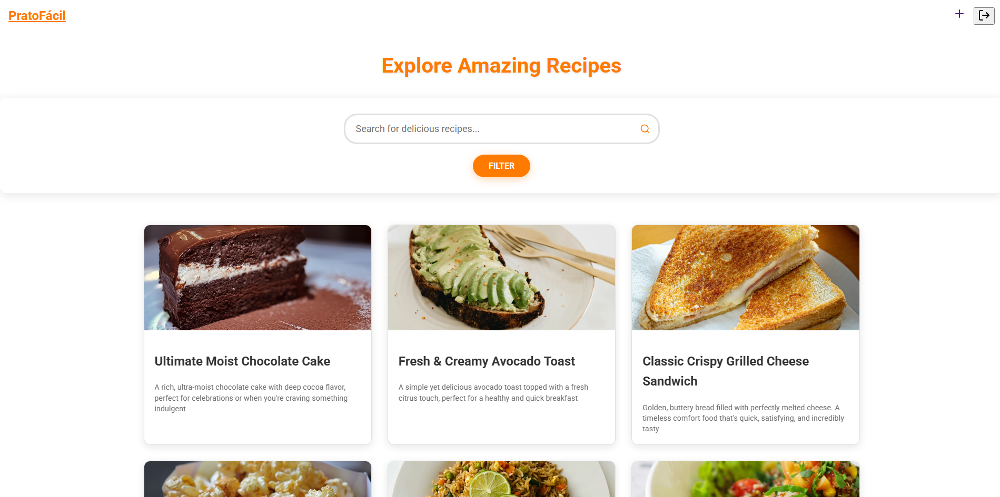
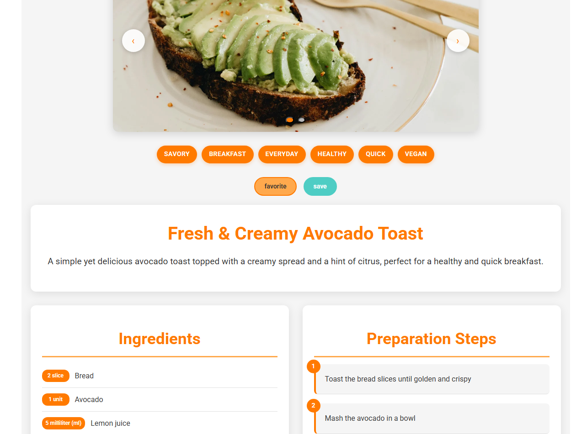

# 🍽️ PratoFacil

<p align="center">
  
</p>

<p align="center">
  A modern full-stack recipe-sharing platform where users can create, explore, save, favorite, and comment on recipes.
</p>

<p align="center">
  <strong>Built with HTML, CSS, JavaScript, PHP, and MySQL</strong>
</p>

---

## 🚧 Repository Structure

This repository contains two versions of the project:

- **Full Application** (`/full-app`)  
  Complete version with backend, authentication, database integration, and dynamic features.

- **Demo Version** (`/demo`)  
  Simplified frontend-only version created for demonstration purposes.

---

## 📌 About The Project

PratoFacil was built as a personal learning project focused on improving my full-stack development skills.

The platform allows users to:

- 🍲 Create recipes
- 🔍 Explore recipes
- ❤️ Favorite recipes
- 💾 Save recipes
- 💬 Comment on recipes
- 📱 Enjoy a responsive experience

This entire project was developed by myself over approximately **3 months**.

---

## 📸 Screenshots

### Home Page

<p align="center">
  
</p>

---

### Recipe Details

<p align="center">
  
</p>

---

### Create Recipe

<p align="center">
  
</p>

---

## 🛠️ Technologies Used

### Full Application

- HTML5
- CSS3
- JavaScript
- PHP
- MySQL
- Cropper.js
- Tom Select

### Demo Version

- HTML5
- CSS3
- JavaScript
- Cropper.js
- Tom Select

---

## 📂 Project Structure

```bash
PratoFacil/
│
├── full-app/      # Main complete application
├── demo/          # Simplified demo version
├── images/        # README screenshots
└── README.md
```

---

## 🚀 Installation

### Requirements

- XAMPP
- Apache enabled
- MySQL enabled

---

### Clone The Repository

```bash
git clone https://github.com/costa-chilaladev/PratoFacil.git
```

---

### Run Locally

1. Move the project folder to:

```bash
xampp/htdocs/
```

2. Start:
- Apache
- MySQL

3. Open in your browser:

```bash
http://localhost/PratoFacil
```

---

## 🌐 Public Demo

> Demo website link coming soon...

---

## 👨‍💻 About Me

Hi! My name is **Constantino Chilala**, and I’m a 16-year-old IT student from Angola.

I’m currently in my first year of studying Information Technology and working toward becoming a full-stack developer.

PratoFacil is my first real and complete programming project. I built it entirely by myself as part of my learning journey into web development.

Through this project, I improved my skills in:

- Frontend development
- Backend development
- Database management
- UI/UX design
- Project organization
- Problem solving

This project represents an important milestone for me as a beginner developer and motivates me to continue learning and building even bigger projects in the future.

---

## ⭐ Final Note

This repository is more than just a school project — it represents my dedication, consistency, creativity, and passion for programming as a young developer starting in the world of technology.

---

## 📄 License

This project is licensed under the MIT License.

---

## 🤝 Credits

Developed with dedication by **Constantino Chilala**

- GitHub: [costa-chilaladev](https://github.com/costa-chilaladev?utm_source=chatgpt.com)